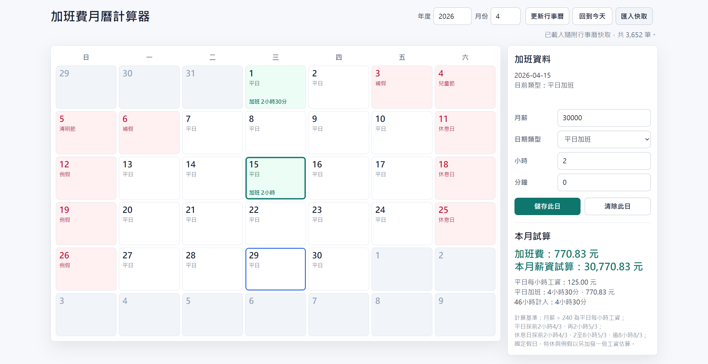

# overtime-pay-calculate

以月為單位的加班費試算工具，支援桌機與手機瀏覽器使用。

## 畫面預覽

## 專案發想

這個專案的起點，是勞動部的[月薪制加班費試算系統](https://calcr2.mol.gov.tw/Monthly)。  
它提供了很實用的試算邏輯，但主要是以「週」為單位來操作。實際在整理自己的出勤與加班時，很多人更常用「整個月」來回頭檢查，因此我想做一個更接近日常使用情境的版本。

而月薪制如果要用月曆方式來看，除了加班時數本身，還會牽涉到那一天到底是：

- 正常工作日
- 休息日
- 例假日
- 國定假日或特休出勤

所以這個工具把政府公布的辦公日曆資料也一起納入，協助判斷一般情況下哪些日子通常放假、哪些日子正常上班，再依照月薪制常見的加班費計算邏輯，試算：

- 當月加班費
- 各類型加班的小計
- 46 小時延長工時統計
- 該月薪資加上加班費後的總額

## 專案特色

- 純前端，沒有後端伺服器也能使用
- 支援桌機與手機操作
- 以月曆方式記錄每天的加班情況
- 優先使用內建的政府行事曆快取資料
- 可手動匯入 `行政機關辦公日曆快取.json`
- 會把月薪與加班紀錄保存在瀏覽器 `localStorage`

## 資料來源與判斷方式

本工具會優先讀取專案內附的 `行政機關辦公日曆快取.json`。  
如果你在頁面上按下「更新行事曆」，則會嘗試重新抓取政府公開資料；若瀏覽器因跨網域限制而無法取得，系統會退回既有快取或以週末規則作為備援。

這樣設計的好處是：

- 一般使用時穩定，不依賴後端
- 保留既有快取與手動匯入的備援方式
- 在官方資料可取得時，仍保留更新彈性

## 使用方式

1. 開啟網站後，先確認上方的年份與月份。
2. 在右側輸入月薪。
3. 點選月曆中的某一天。
4. 確認或調整該日的日期類型。
5. 輸入加班的小時與分鐘。
6. 按下「儲存此日」。
7. 系統會自動更新當月的加班費與薪資試算結果。

如果要修改同一天的資料，直接重新選取日期並覆寫即可。  
如果要刪除該日紀錄，選取後按「清除此日」。

## 操作說明

### 年份與月份

- 可直接輸入年份與月份切換月曆
- 按「回到今天」可快速回到目前日期所在月份

### 日期類型

系統會依照政府行事曆資料，自動推測預設的日期類型，但你仍可以手動調整。常見類型包含：

- 平日加班
- 休息日加班
- 國定假日 / 特休出勤
- 例假出勤

### 匯入快取

如果你想自行指定行事曆資料，可以使用「匯入快取」載入 JSON 檔。  
匯入後會先保存在目前瀏覽器中，重新整理後仍可沿用。

### 更新行事曆

- 會嘗試抓取最新公開資料
- 若來源網站限制跨網域讀取，更新可能失敗
- 失敗時頁面仍會保留既有快取，不會直接失去功能

### 試算結果

右側會顯示：

- 加班費總額
- 本月薪資試算
- 各類型加班的小計
- 46 小時延長工時統計
- 可能需要注意的警示訊息

## 計算邏輯

本工具目前沿用月薪制常見試算方式：

- 平日每小時工資 = 月薪 / 240
- 平日加班：前 2 小時以 `4/3` 計，再 2 小時以 `5/3` 計，超過 4 小時部分以 `2` 倍計
- 休息日加班：前 2 小時以 `4/3` 計，第 3 到第 8 小時以 `5/3` 計，超過 8 小時部分以 `8/3` 計
- 國定假日、特休、例假出勤：以另加一倍工資方式估算

另外也會針對較常見的情況提示警示，例如：

- 平日單日加班超過 4 小時
- 休息日單日加班超過 12 小時
- 例假出勤
- 當月平日加班加休息日出勤超過 46 / 54 小時

## 主要檔案

這個版本是純靜態網站，主要檔案只有：

- `index.html`
- `app.js`
- `styles.css`
- `行政機關辦公日曆快取.json`

## 注意事項

- 本工具以一般月薪制、固定週休規則與公開行事曆資料為基礎，適合做快速整理與試算。
- 實際工資、出勤性質、公司制度、變形工時、輪班制度、補休約定與法令適用情況，仍可能影響真正結果。
- 若作為正式薪資或法律判斷依據，建議再與公司制度、最新法規或專業意見交叉確認。
